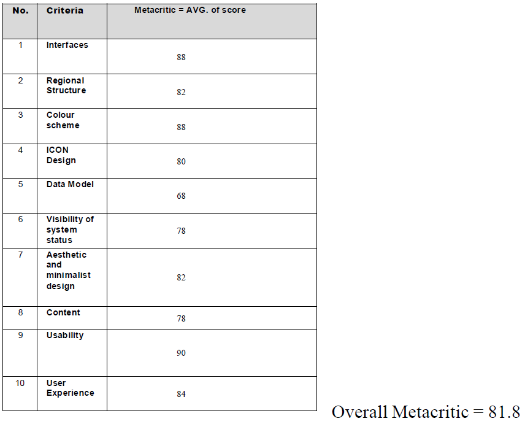

# [COM520 Assignment](https://github.com/JustGinger888/COM520_Assignment)

## Introduction

### Task Centre Design vs user-centered Design

For this project, I decided to incorporate both TCD and UCD aspects within the overall design. The tasks must be simple and straightforward with no complexities, functioning in an ordered manner each accessible with no prior knowledge of the pages or site. The user-centered aspect comes in form of relevant illustrations and well laid out forms, each unique and non-dependant on the previous. My reasoning for this is because job seekers and employers alike do not want to struggle with the creation of accounts and doing their respective tasks. Even so, we live in a visually centered world where if there is an abundance of text or visually unappealing aspects to a site, it would immediately be judged and often categorized as unprofessional, leading to a lack of user engagement.

---

### Analysis of Sites

The Attached Excel Document analyses various other job sites and critically analyses them.

---

### User Group

The website is done for the Steady Paycheck Agency, which focuses on advertising and pushing jobs in the field of Information Technology to graduates with a relevant background. Hence there will be two user groups which I will be discussing below, Employers & Job Seekers.

#### Employers

Employers will be looking to post listings for positions on the site, advertising and gathering responses accordingly. They will need to be able to view all listings whether they be drafts, active, or expired with the appropriate options available to each. They should also be able to see the responses to the respective job listings in their own individual enclosure. Employers must have a job creation-centered view as they would not want to search for any open positions themselves.

##### Tasks & Goals

- Sign up
- To post a job, employers must be able to sign up and create a profile by inputting data.
- Post a job
- Once registered or signed in, they can post a job by filling out a form discussing details.
- View Potential Candidates
- Once posted, a list of candidates can be viewed under the relevant job position.

##### Experience Levels

- Posters would usually be higher up in the organization and have some experience with creating listings and recruiting suitable candidates.

##### Required Information

- Username
- Password
- Company Information
- Job Listings

---

#### Job Seeker

Job Seekers will be looking to find open vacancies at multiple companies based on search parameters in their local area. They would also want to upload and have easy access to their CV and personal information. Moreover, a way to create a CV easily and effectively which they can use to apply would be ideal for Seekers.

##### Tasks & Goals

- Sign up
- Seekers can sign up to the website in order to upload their CV and easily apply for jobs
- Create CV
- They can create a CV based on 3 major parameters and follow the process step by step in order to produce a template
- Search
- The search would allow Seekers, Signed in or not, to search for a specific job in their area and display the results to be further examined
- Apply
- Once a job has been found users can apply for it accordingly

##### Experience Levels

- Job Seekers would be inexperienced and often freshly graduated, not having much knowledge of applying for jobs.

##### Required Information

- Username
- Password
- Education & Qualifications
- Work Experience
- Skills & Technologies

User Analysis (Aims primarily at identifying the main user goals)

---

## Personas

All personas were created with the help of an online template and the profile pictures are all AI-generated from [thispersondoesnotexist.com](https://thispersondoesnotexist.com/).

### A. Build 2 personas of a typical Jobseeker

#### Task Analysis (Aims primarily at identifying the main system tasks)

- Register to the website
- Login to the website
- Create a CV
- Fill out forms with personal information
- Education
- Qualifications
- Work Experience
- Upload CV
- Update profile
- Use the navbar to navigate between pages
- Search for a Job
- Enter Job Title
- Enter Job Location
- Press search to Navigate
- Narrow Search Results
- Select Salary Range
- Select Within Range.
- Examine Jobs by clicking
- Read the job description.
- Apply for a job

#### Hierarchal Task Analysis chart

---

### B. Build 2 personas of a typical Employer

#### Task Analysis (Aims primarily at identifying the main system tasks)

- Register to the website
- Login to the website
- Update company profile.
- Use the navbar to navigate between pages
- Create new listings
- Update Details
- Create Descriptions
- View Listings
- Drafts
- Active
- Expired
- Add the job description.
- View responses to postings listed

#### Hierarchal Task Analysis chart

---

## Design Proposition

I decided to use Adobe XD due to its extensive plugin lineup, providing illustrations and icons to make for a coherent and modern design throughout my prototype. The sharing and online design viewer is also relatively easy to use and share.

The project itself contains a login and sign-up view, CV uploading and creation sections, A search functionality for Job Seekers, and a dashboard for employers to post and view responses on job applications.

As I am relatively inexperienced with this tool, especially for a project of this scale there are some quirks that make it hard to navigate. Most noticeably on the qualification section of the CV creator where you have to click the arrow twice to progress through.

[https://xd.adobe.com/view/8c4b7818-08ca-4b0e-bec9-bb5afca0440e-d918/](https://xd.adobe.com/view/8c4b7818-08ca-4b0e-bec9-bb5afca0440e-d918/)

---

## Logo

For the logo, I decided to make use of a simple circular logo with cursive SP to represent the Simple Paycheck company. The purple colour is a symbol of leisure and elegance and shows the sophistication of the situation.

|||
|---|---|
|Icon Size|Full Size|

---

## Testing & Integration

### Participant Reviews

To test my proof of concept Prototype, I had 5 willing participants individually fill out the tables listed below. giving me a clear indication of their experience with the prototype.

|||
|---|---|---|---|
|||
||

### Metacritic

After tallying up the scores from the reviews above I was able to determine the average experience with the prototype accordingly. Allowing me to see first hand which areas I should improve on if I wish to continue with this project.

To improve on this prototype the first thing that would need to be addressed is the addition of dummy data for demonstration purposes. Due to my lack of knowledge in using the tool I could not find a way for users to actually input data in the prototype and check whether it matches a set of data for either job seekers and employers. Moreover, the Job search displays 5 records upon clicking but are not individually addressable. This is something that could be achieved through better knowledge of the software and experience in designing as I read up about hover states in the documentation but couldn't quite figure out how they work. If these were however added my overall score would definitely have bettered itself.

As for the system keeping users informed about what is going on, through appropriate feedback, I could have improved this by including more responsive popups for each button click or again utilise hover states to change colour upon hover. This would have visually indicated the interactivity of the system buttons and drastically reduced the number of pages I added to the prototype, as the current system changes button colours only after the click. Tooltips could also have allowed the system to visually indicate what data is required or the destination buttons, such as the continue found in CV creation, would have taken users.

Ensuring the prototype contents are more relevant and displayed according to HCI theories would have been achievable by better repositioning some buttons on forms. At current some buttons such as the submit and delete ones on employers listing modal are quite far apart, meaning users would have to use longer mice drags to reach destination buttons. Simply putting them next to one another would have made this much more user friendly and increase ease of use.

However, the overall perception of my prototype is relatively positive with a large emphasis on the usability of the project. This is quite an achievement for me as I am not familiar with the design of this sort. With a better knowledge of the Adobe XD prototyping tool I would have been able to improve this score. However, for now, I would call the project a success and one that sufficiently sets out to achieve its initial purpose.
